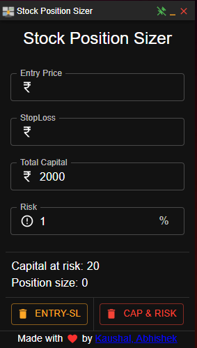

# Position Size Calculator

Desktop App to determine the capital at risk and position size based the entry price and stop loss.

**Entry Price**: Price at which trade executed 
**StopLoss**: Stop loss of the trade 
**Total Capital**: Total amount of capital deployed 
**Risk**: Total amount risked in % 
### Steps to run

`git clone https://github.com/akaushal123/stock-postion-sizer.git`

`cd stock-postion-sizer`

`npm install`

Development server
`npm run dev`

Production build `npm run build`

After these commands, build folder will be created in the directory.

- In `stock-position-sizer` a folder name `dist` will be created.
- In the `dist` there will be a File called `Stock Position Sizer setup 0.1.0.exe`
- Run the setup
- Voila! :tada: :confetti_ball: _**Stock Position Sizer**_ app is installed.

Logo from [freepik](https://www.freepik.com/)