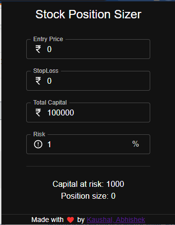

# Position Size Calculator

Chrome extension used to determine the capitalat risk and position size based the entry price and stop loss.

### Steps to run

`git clone https://github.com/akaushal123/stock-postion-sizer.git`

`cd stock-postion-sizer`

`npm install`

`npm run build`

After these commands, build folder will be created in the directory.
- Go to [**chrome://extensions/**](chrome://extensions)
- Toggle Developer mode 
- Click on `Load unpacked`
- Browse to `build` folder and select it.
- Voila! :tada: :confetti_ball: Extension added with name _**Stock Position Sizer**_

